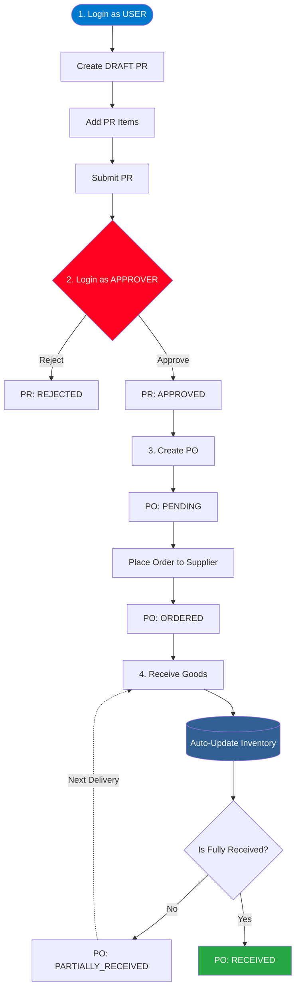

# 📦 Backend Technical Test - Inventory & Purchase System


## 📖 Ringkasan Proyek (Project Overview)

Proyek ini adalah sistem _Backend_ untuk manajemen **Inventory dan Purchase Request**. Sistem ini dirancang untuk menangani pencatatan Master Data (Produk, Supplier, Gudang), pergerakan stok barang, hingga alur persetujuan (Approval) untuk pengadaan barang secara _End-to-End_.

### 🗺️ Status Fitur (Roadmap)

**Core Requirements:**

- [x] **Authentication**: Login dengan JWT (HttpOnly Cookie), RBAC statis (USER & APPROVER).
- [x] **Master Data**: CRUD Produk, Supplier, dan Gudang (Warehouse).
- [x] **Purchase Request (PR)**: Pembuatan PR oleh USER, daftar PR.
- [x] **Approval Workflow**: Persetujuan/Penolakan PR oleh APPROVER.
- [x] **Purchase Order (PO)**: Konversi PR yang disetujui menjadi PO ke Supplier.
- [x] **Goods Receipt (GR) & Inventory**: Penerimaan barang (GR) yang otomatis menambah stok Inventory (Database Transaction).


**Bonus Points Achieved:**
- [x] **Audit Trail**: Melacak riwayat aksi penting di database.
- [x] **Idempotency**: Mencegah klik-ganda (*double-submit*) pada API transaksional.
- [x] **Docker & CI Pipeline**: Siap *deploy* dengan Docker Compose dan Github Actions.
- [x] **Clean Architecture (3-Tier)**: Pemisahan tegas antara Controller, Service, dan Model.

## 🛠️ Tech Stack

- **Runtime & Package Manager**: Bun
- **Web Framework**: ElysiaJS
- **Language**: TypeScript (Strict Mode)
- **Database**: PostgreSQL 15
- **ORM & Migrations**: Drizzle ORM
- **Validation**: Elysia TypeBox (`t.Object`, `t.String`, dll) + Drizzle-Typebox
- **Documentation**: Swagger/OpenAPI (Dirender menggunakan Scalar UI)
- **Infrastructure**: Docker & Docker Compose

## 📂 Struktur Proyek (Project Structure)

Proyek ini secara ketat mengadopsi struktur berbasis fitur (_Vertical Slice / Domain-Driven_).

- `src/modules/`: Berisi berbagai domain bisnis (seperti `auth`, `products`, dll). Setiap modul wajib memisahkan HTTP Controller (`index.ts`), Logika Bisnis (`service.ts`), dan Skema Database/Validasi (`model.ts`).
- `src/config/`: Konfigurasi global (Database, Env).
- `src/utils/`: Fungsi utilitas _reusable_ (seperti setup JWT, _Route Guard/Middleware_, Seeder).
- `*.test.ts`: _Integration & E2E Type-Safe Testing_ menggunakan Eden Treaty diletakkan berdampingan langsung di dalam folder modul masing-masing.

## 🔄 Alur Bisnis Utama (Business Flow)



## 🗄️ Struktur Database Utama

Sistem ini terdiri dari beberapa entitas tabel yang dikelompokkan berdasarkan domain bisnisnya:

```mermaid
erDiagram
    USERS {
        serial id PK
        varchar username UK
        varchar password
        enum role "USER | APPROVER"
        timestamp created_at
        timestamp updated_at
    }

    PRODUCTS {
        serial id PK
        varchar sku UK
        varchar name
        varchar unit
        boolean is_active
        timestamp created_at
        timestamp updated_at
    }

    SUPPLIERS {
        serial id PK
        varchar name
        varchar email
        varchar phone
        boolean is_active
        timestamp created_at
        timestamp updated_at
    }

    WAREHOUSES {
        serial id PK
        varchar code UK
        varchar name
        varchar location
        boolean is_active
        timestamp created_at
        timestamp updated_at
    }

    PURCHASE_REQUESTS {
        serial id PK
        varchar request_number UK
        integer warehouse_id FK
        integer requested_by FK
        enum status "DRAFT|SUBMITTED|APPROVED|REJECTED"
        timestamp created_at
        timestamp updated_at
    }

    PURCHASE_REQUEST_ITEMS {
        serial id PK
        integer purchase_request_id FK
        integer product_id FK
        integer quantity
    }

    PURCHASE_ORDERS {
        serial id PK
        varchar po_number UK
        integer purchase_request_id FK
        integer supplier_id FK
        enum status "PENDING|ORDERED|PARTIALLY_RECEIVED|RECEIVED|CANCELLED"
        timestamp created_at
        timestamp updated_at
    }

    PURCHASE_ORDER_ITEMS {
        serial id PK
        integer purchase_order_id FK
        integer product_id FK
        integer quantity
        timestamp created_at
    }

    GOODS_RECEIPTS {
        serial id PK
        varchar gr_number UK
        integer purchase_order_id FK
        integer received_by FK
        timestamp created_at
    }

    GOODS_RECEIPT_ITEMS {
        serial id PK
        integer goods_receipt_id FK
        integer product_id FK
        integer quantity
        timestamp created_at
    }

    INVENTORY_BALANCES {
        serial id PK
        integer warehouse_id FK
        integer product_id FK
        integer stock
        timestamp updated_at
    }

    INVENTORY_MOVEMENTS {
        serial id PK
        integer warehouse_id FK
        integer product_id FK
        integer quantity
        varchar reference_type
        varchar reference_id
        timestamp created_at
    }

    AUDIT_LOGS {
        serial id PK
        varchar entity_name
        integer entity_id
        varchar action
        integer performed_by FK
        timestamp created_at
    }

    IDEMPOTENCY_KEYS {
        serial id PK
        integer user_id FK
        varchar request_path
        varchar method
        varchar idempotency_key
        json response_body
        integer response_status
        timestamp created_at
    }
```



### Penjelasan Domain Data:
1. **Master Data:** `users`, `products`, `suppliers`, `warehouses`. Menyimpan data induk yang menjadi referensi transaksi.
2. **Procurement (Pengadaan):** `purchase_requests` & `purchase_orders`. Mencatat alur permintaan dari internal hingga pemesanan resmi ke pihak *Supplier*. Keduanya memiliki tabel *Items* masing-masing untuk mencatat detil produk.
3. **Goods Receipt (Penerimaan):** `goods_receipts`. Mencatat bukti serah terima barang secara fisik dari *Supplier*.
4. **Inventory (Persediaan):** `inventory_balances` (total stok saat ini) & `inventory_movements` (buku besar/histori keluar-masuk barang).
5. **System:** `audit_logs` (rekaman jejak aktivitas) & `idempotency_keys` (mencegah duplikasi data API).

## 🧠 Keputusan Teknis (Engineering Decisions)

- **Arsitektur Ketat (Controller vs Service)**: Mengikuti struktur berbasis fitur dari ElysiaJS. _Controller_ (`index.ts`) khusus mengurus HTTP (Cookie, status code), sedangkan _Service_ (`service.ts`) menangani logika bisnis.
- **Dokumentasi API Terpadu (@elysia/openapi)**: Memanfaatkan standar Swagger/OpenAPI (`@elysia/openapi`) namun dirender menggunakan Scalar UI untuk tampilan yang lebih modern, lengkap dengan _code snippet_.
- **E2E Type-Safe Testing (Eden Treaty)**: Menggunakan klien `@elysiajs/eden` (Treaty) untuk _integration testing_. Klien ini otomatis membaca tipe data dari _backend_ (Elysia App Instance) langsung ke file test tanpa harus menebak bentuk Response JSON.
- **Validasi DRY (Drizzle-Typebox)**: Men-generate skema validasi request/response Elysia (TypeBox) secara otomatis dari skema tabel Drizzle ORM.
- **Manajemen Peran (Role Enum)**: Diimplementasikan sebagai `pgEnum` ("USER", "APPROVER") native di PostgreSQL agar _type-safe_ di level database maupun aplikasi, menghindari tabel relasional yang _over-engineered_ untuk kasus sederhana ini.
- **Pemisahan Inventory**: Saldo saat ini (`inventory_balances`) dan histori mutasi (`inventory_movements`) dipisah. Hal ini memastikan setiap pergerakan terekam dengan jelas (Auditabilitas) dan mencegah *race condition* saat kalkulasi stok massal.
- **Data Consistency via Transactions**: Seluruh transaksi kritikal (Submit PR, Goods Receipt) dibungkus dalam *Database Transactions* (`db.transaction`). Jika proses update stok gagal, seluruh data Goods Receipt akan di-*rollback* otomatis.

## 🚀 Cara Menjalankan (Setup & Run)

### 1. Environment Variables

Salin contoh file _env_:

```bash
cp .env.example .env
```

### 2. Menggunakan Docker (Direkomendasikan)

Cara paling mudah untuk menjalankan aplikasi dan _database_ sekaligus:

```bash
docker compose up -d --build
```

Aplikasi akan menyala di `http://localhost:3000`.

### 3. Cara Menjalankan Tanpa Docker (Lokal)

Jika Anda ingin menjalankannya secara lokal menggunakan Bun:

1. Pastikan PostgreSQL sudah menyala dan sesuaikan `DATABASE_URL` di `.env`.
2. Install dependensi: `bun install`
3. Jalankan migrasi _database_: `bun run db:migrate`
4. Jalankan aplikasi: `bun run dev`

---

## 🌱 Seeding Database (Penting untuk Penguji)

Untuk memudahkan pengujian (baik via Scalar UI maupun Postman), jalankan _Seeder_ untuk mengisi _Master Data_ dan 2 Akun Utama secara otomatis:

```bash
bun run db:seed
```

**Akun yang digenerate:**

- **USER:** username: `staff_user` | password: `password123`
- **APPROVER:** username: `manager_approver` | password: `password123`

_(Catatan: Jika menggunakan Docker, Anda bisa menjalankan seeder ke dalam container dengan `docker exec -it <container_name> bun run db:seed`)_

---

## 🧪 Pengujian (Testing)

**Penting:** Seluruh pengujian ini adalah _Integration/E2E Test_ yang menggunakan database PostgreSQL secara langsung melalui Eden Treaty. Pastikan database Anda sudah menyala dan _seeder_ (`bun run db:seed`) telah dijalankan sebelum memulai pengujian.

Menjalankan _Integration & E2E Type-Safe Test_ (termasuk skenario validasi, penolakan auth, dan flow success):

```bash
bun test
```

## 📚 Dokumentasi API (Swagger / Scalar UI)

Buka tautan berikut di _browser_ Anda untuk mengakses Dokumentasi API secara interaktif:
👉 **[http://localhost:3000/openapi](http://localhost:3000/openapi)**
